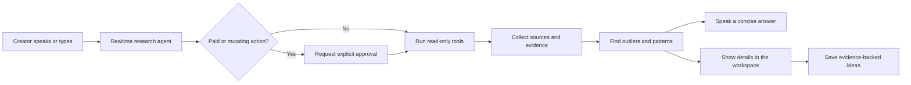
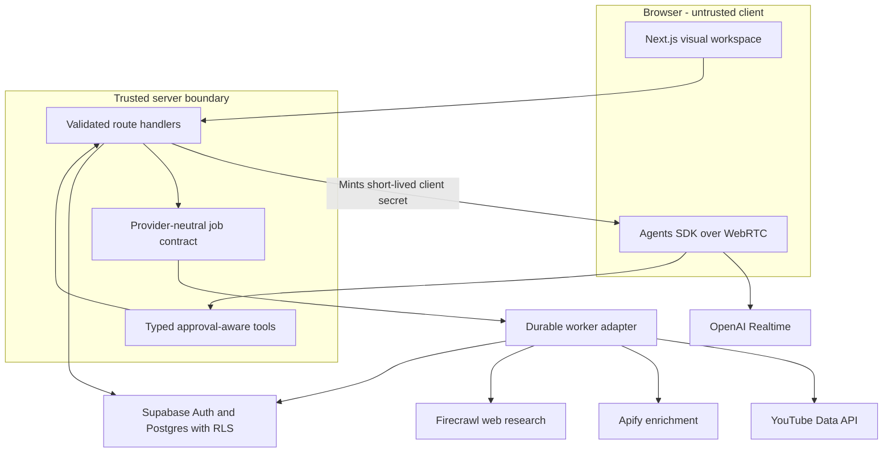
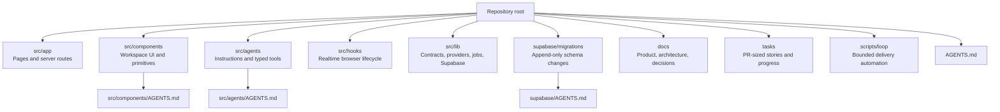

# YouTube Growth Stack

YouTube Growth Stack is an open-source, voice-first research agent for creators. Ask it to find competitor outliers, explain evidence-backed patterns, and turn those patterns into video ideas. Voice controls the work; the visual workspace shows the sources, status, and detailed results needed to verify it.

The project is built for independent creators and small content teams that currently research competitors by hand and want a faster, repeatable workflow without giving an autonomous agent unchecked authority to spend money or publish content.

## Product experience



The intended product loop is:

1. Create a project and describe a niche.
2. Add competitor channels or ask a research question.
3. Approve research that may consume provider credits.
4. Collect YouTube data and optional external enrichment.
5. Inspect outliers, patterns, content gaps, and their sources.
6. Generate and save evidence-backed ideas through voice or text.

Text remains available for URLs, names, accessibility, and precision. Raw microphone audio is not persisted by default.

## Current status

This repository is an active foundation, not a hosted production service.

- The voice-first frontend, typed tool contracts, OpenAI Realtime session lifecycle, provider adapters, durable-job boundaries, Supabase schema, and demo workspace are integrated in code.
- Live-provider probes for Apify and Firecrawl have succeeded with authorized credentials. These services may consume credits and are never invoked by the normal test suite without explicit configuration.
- The current OpenAI credential is externally blocked by an upstream `401`, so a live Realtime voice session has not been verified with that credential. The server-side client-secret flow and failure behavior are covered by tests.
- The Supabase-backed durable worker, atomic job claiming, retry leases, and Apify resume behavior are implemented and tested. A Supabase project still needs to be configured, its reviewed migrations deployed, and a trusted scheduler connected before persistence runs end to end.
- YouTube publishing, billing, team workspaces, and fully autonomous production changes are outside the MVP scope.

Do not interpret a queued job, minted Realtime client secret, or passing provider probe as proof that an entire research run completed.

## Architecture



Trust boundaries are deliberate:

- Standard API keys, provider tokens, actor credentials, and the Supabase service role stay on the server.
- The browser receives only a short-lived OpenAI Realtime client secret and the public Supabase URL/anon key.
- Browser tools call validated application routes; they never import provider SDKs or trusted clients directly.
- Route and tool boundaries use Zod contracts.
- User-owned database rows are protected with row-level security.
- Raw microphone audio is not copied into local history or stored in Supabase by default.
- Detailed evidence belongs in the visual workspace; spoken responses stay concise.

See [the architecture overview](docs/architecture/overview.md), [voice runtime](docs/architecture/voice-runtime.md), [durable jobs](docs/architecture/jobs.md), and [data model](docs/architecture/data-model.md) for the deeper contracts.

## Local setup

### Prerequisites

- Node.js 20 or newer
- npm
- Provider accounts only for the integrations you intend to exercise

Install dependencies and create a local environment file:

```bash
npm ci
cp .env.example .env.local
npm run dev
```

Open [http://localhost:3000](http://localhost:3000). The UI and demo workspace can be explored without configuring every provider. Live voice, persistence, and provider research require their corresponding credentials and infrastructure.

Never commit `.env.local`. Do not add `NEXT_PUBLIC_` to a server secret.

For durable research, apply the Supabase migrations in timestamp order, authenticate a creator, and create a project owned by that user. Configure a trusted scheduler to call `POST /api/jobs/process` with `x-job-worker-secret`. Each request claims and processes at most one approved job; an `idle` response means no work is due. The service-role key and worker secret must never enter browser code.

### Environment variables

The following table covers every variable in [`.env.example`](.env.example):

| Variable                        | Required for                          | Exposure and notes                                                                                                                            |
| ------------------------------- | ------------------------------------- | --------------------------------------------------------------------------------------------------------------------------------------------- |
| `OPENAI_API_KEY`                | Live voice sessions                   | Server-only standard API key used to mint short-lived Realtime client secrets.                                                                |
| `YOUTUBE_API_KEY`               | Official YouTube metadata             | Server-only; the primary source for YouTube-native data.                                                                                      |
| `APIFY_API_TOKEN`               | Optional YouTube enrichment           | Server-only; use only after explicit approval because runs may consume credits.                                                               |
| `APIFY_ACTOR_ID`                | Optional Apify enrichment             | Server-only actor identifier. The example contains the supported default actor ID, not a secret.                                              |
| `FIRECRAWL_API_KEY`             | Optional external web research        | Server-only; Firecrawl supports public-page research, not YouTube-native metrics. Runs may consume credits.                                   |
| `NEXT_PUBLIC_SUPABASE_URL`      | Browser Supabase client               | Public project URL; safe for the browser.                                                                                                     |
| `NEXT_PUBLIC_SUPABASE_ANON_KEY` | Browser Supabase client               | Public anon key; access still depends on row-level security.                                                                                  |
| `SUPABASE_SERVICE_ROLE_KEY`     | Trusted server/worker database access | Highly privileged and server-only. Never expose it to the browser.                                                                            |
| `JOB_WORKER_SECRET`             | Trusted scheduler authentication      | Server-only random value of at least 32 characters, sent only through the `x-job-worker-secret` header.                                       |

The server schema also supports an optional `OPENAI_REALTIME_MODEL`; it is intentionally fixed to and defaults to `gpt-realtime-2.1`. `RUN_LIVE_APIFY_TEST=1` is a test-only opt-in for the live Apify probe and is not an application configuration value.

## Commands

| Command                  | Purpose                                                                            |
| ------------------------ | ---------------------------------------------------------------------------------- |
| `npm run dev`            | Start the Next.js development server.                                              |
| `npm run lint`           | Run ESLint with zero warnings allowed.                                             |
| `npm run typecheck`      | Type-check with TypeScript without emitting files.                                 |
| `npm run test`           | Run the Vitest unit/integration suite; paid live probes remain skipped by default. |
| `npm run test:watch`     | Run Vitest in watch mode.                                                          |
| `npm run test:e2e`       | Run Playwright end-to-end tests.                                                   |
| `npm run format`         | Format the repository with Prettier.                                               |
| `npm run format:check`   | Check formatting without writing changes.                                          |
| `npm run build`          | Create a production Next.js build.                                                 |
| `npm run start`          | Serve the production build.                                                        |
| `npm run verify`         | Run lint, type-checking, tests, and the production build in sequence.              |
| `npm run security:audit` | Audit production dependencies with npm.                                            |

Before requesting review, run:

```bash
npm run verify
npm run security:audit
git diff --check
```

## Approval and safety model

The agent separates read-only inspection from actions that cost money or change state.

- Paid provider research must pause for explicit human approval.
- Writes, publishing, deletion, and destructive migrations require approval.
- A tool response reports its real state: `accepted` or `queued` never means `completed`.
- Provider calls that may take time belong in durable workers, not interactive route handlers.
- Source provenance stays attached to evidence so observed metrics remain distinguishable from inferred explanations.
- Production migrations are reviewed, append-only, and applied by an authorized human.
- The repository does not persist raw microphone audio by default.

## Repository guide



Start with:

- [Product vision](docs/product/vision.md) and [MVP definition](docs/product/mvp.md)
- [Architecture overview](docs/architecture/overview.md)
- [Realtime architecture decision](docs/decisions/0001-voice-first-realtime.md)
- [Root agent guide](AGENTS.md), then the nearest nested `AGENTS.md`
- [Foundation specification](tasks/000-foundation/specification.md) and its story/progress files

## Contributing

```mermaid
flowchart LR
  Read["Read AGENTS.md, spec, and progress"] --> Select["Select one failing story"]
  Select --> Inspect["Inspect contracts, tests, and boundaries"]
  Inspect --> Implement["Implement only its acceptance criteria"]
  Implement --> Targeted["Run focused checks"]
  Targeted --> Verify["Run npm run verify"]
  Verify --> Security["Audit, diff, and secret checks"]
  Security --> Record["Update story state and progress"]
  Record --> Review["Open for human review"]
  Review --> Stop["Never auto-merge"]
```

Contributions should be small, evidence-backed, and reviewable. Work on a feature branch, never directly on `main`, and keep one change scoped to one failing story in `tasks/<feature>/stories.json`.



When changing Next.js behavior, read the version-matched guides in `node_modules/next/dist/docs/` first. Preserve voice interruption, transcript and text fallbacks, keyboard access, visible focus, semantic theme tokens, provider boundaries, and truthful tool states. Add migrations rather than editing migrations that may already have been applied.

Do not commit credentials, `.env.local`, generated browser artifacts, private attachments, or provider output containing sensitive data. Live tests that spend credits must remain explicit opt-ins.

## License

Released under the [MIT License](LICENSE). Copyright (c) 2026 Harshit Wadhiparty.
